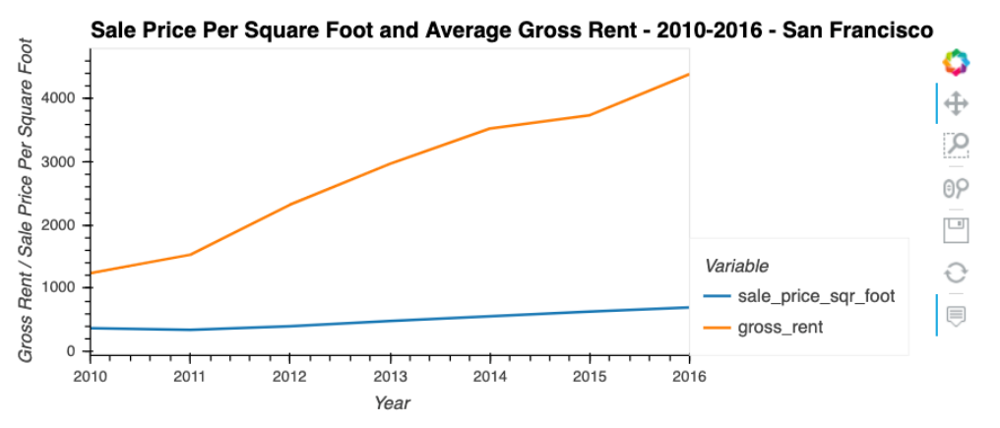
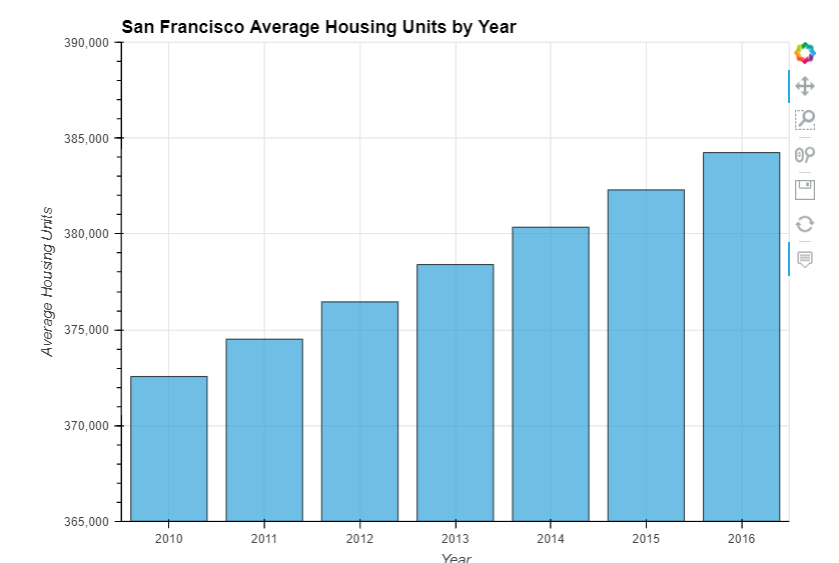
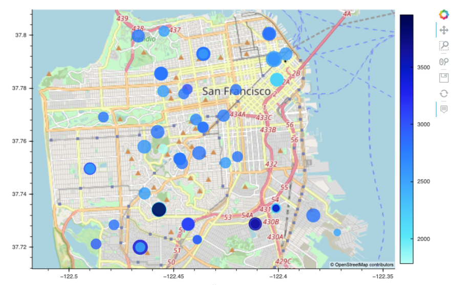

# Fintech Proptech Property Analyzer

Jupyter Notebook containing data aggregation, interactive visualizations, and geospatial analysis, to find properties in the San Francisco market that are viable investment opportunities.

## Technologies

The application uses the following technologies:

- Python 3.7
- [pandas](https://pandas.pydata.org/pandas-docs/stable/index.html)
- [Jupyter Lab](https://jupyter.org/)
- [PyViz (Holoviz)](https://hvplot.holoviz.org/)

## Installation Guide

```python

pip install numpy
pip install pandas
pip install matplotlib
conda install -c pyviz hvplot geoviews

```

### Jupyter

The application is based on a Jupyter Notebook. The minimum required is a Jupyter Notebook but Jupyter Lab can be installed as well.  Please review the [Jupyter installation instructions](https://jupyter.org/install)

## Usage

### Startup

- Launch Jupyter
- Load **risk_return_analysis.ipynb** and select **Run => Restart Kernal and Run all Cells** from the menu

### Inputs

Two Comma Separated Values (.CSV) files containing San Francisco neighborhood location and housing cost information:

- **neighborhood_coordinates.csv**: contains latitude and longitude information for seventy-two San Francisco neighborhoods.
- **sfo_neighborhoods_census_data.csv**: contains gross rent and average sale price per square foot for homes in San Francisco between 2011-2016

### Analsyis Output Examples

The data was loaded into pandas DataFrames and various types of analysis was conducted to determine rent and sales price trends including:

- Comparison of trends between gross rent and average sale price per year
- Neighborhood analysis via interactive chart filtering
- Visual analysis via interactive geographic mapping







## Brief Analysis Review

While the average sale price per square foot decreased in 2011 by 7.4%, gross rent increased 23.5% and this trend continued through 2016.  The strong demand for rental properties despite increasing rent prices are most likely a reflection of the relatively high cost per square foot of housing. The total cost of a home, combined with property taxes which are a percentage of the home's value, make them unaffordable to many.  One click buy strategies would likely be most successful in the downtown areas, particularly in Union Park where the average sales price per square foot is highest.  Rental strategies would be most effective in the southern part of San Francisco, particularly in the Westwood Park neighborhood.

## Contributors

- Jacob Rougeau

## License

MIT
